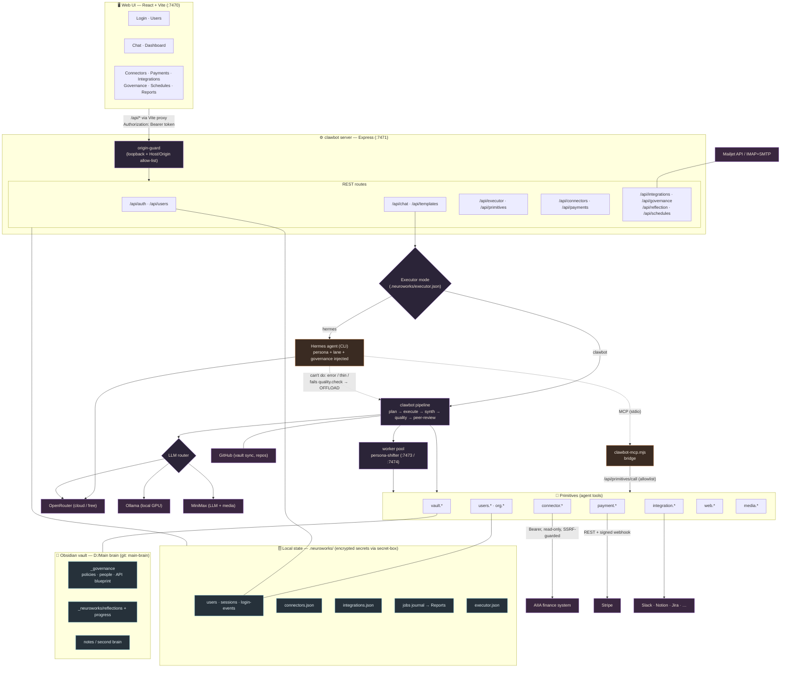
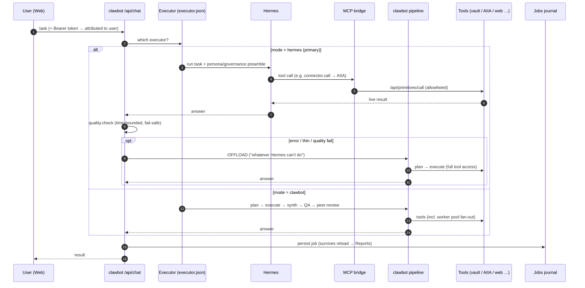
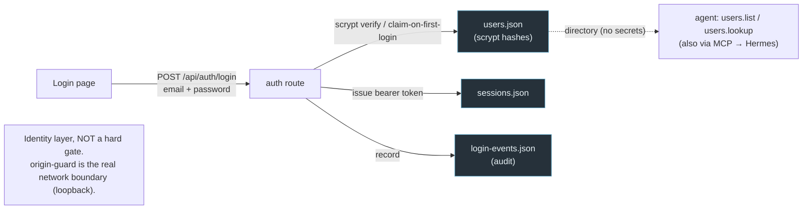

# NeuroWorks / clawbot — System Architecture

_Generated 2026-06-08. Render in Obsidian, VS Code (Markdown Preview Mermaid Support), or GitHub._

## 1. System map



## 2. Task execution flow (executor + offload + MCP)



## 3. Identity / auth layer



## Notes

- **Executor is a live runtime switch** (`POST /api/executor`) — no restart. Hermes is primary now, with automatic offload to clawbot on failure / thin answer / failed quality gate.
- **MCP bridge** lets Hermes call clawbot's own tools (16-tool allowlist: vault, connectors → AIIA, integrations, web reads, users directory, payment status). Money-moving (`payment.link`) and writes are excluded.
- **Secrets** (connector tokens, integration creds, user passwords) are encrypted/hashed at rest under `.neuroworks/` (AES-256-GCM via secret-box; scrypt for passwords).
- **Two git repos:** the clawbot code repo and the `main-brain` vault repo (auto-committed by the commit queue).
```
