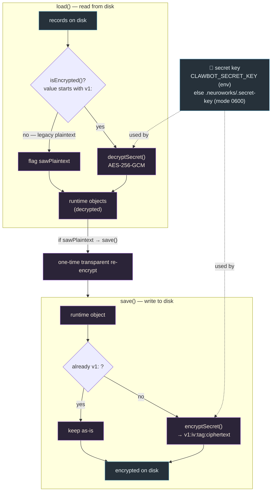
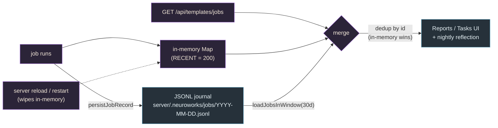
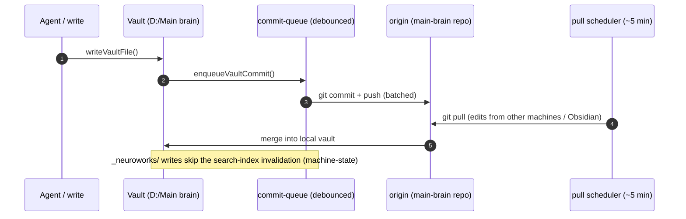
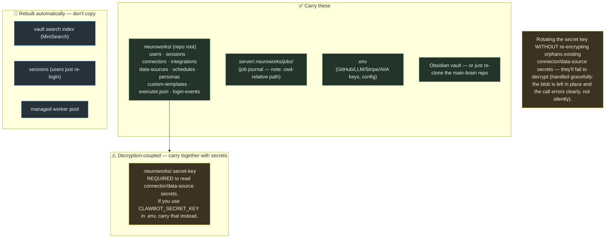

# NeuroWorks / clawbot — Data Migration & Movement

_Generated 2026-06-09. Render in Obsidian, VS Code (Markdown Preview Mermaid Support), or GitHub._

How data moves, persists, and migrates across the system: at-rest encryption migration, job-state recovery, vault git sync, and moving the whole workspace to a new machine.

## 1. At-rest secret migration (legacy plaintext → encrypted)

Applies to `data-sources.json` (DB connection strings) and `connectors.json` (auth tokens) — both use the shared `secret-box` (AES-256-GCM). Legacy plaintext records are migrated transparently on the next write; no manual step.



> User passwords (`users.json`) use a one-way **scrypt** hash (not the reversible box) — they're never decrypted, only verified.

## 2. Job-state persistence & recovery (Reports survive reloads)



## 3. Vault data sync (local ⇄ main-brain git)



## 4. Migrating the workspace to a new machine



## Notes

- **One box, two consumers:** `secret-box.ts` (AES-256-GCM) backs both `data-sources` and `connectors`; integrations encrypt on write from the start. Passwords are scrypt (one-way).
- **Two git repos move independently:** the clawbot **code** repo and the **main-brain vault** repo. The vault auto-commits via the commit queue; code is committed manually.
- **Path quirk to remember when migrating:** the job journal lives under `server/.neuroworks/jobs/` (resolved from `process.cwd()`), while the rest of the machine state lives under the repo-root `.neuroworks/`. Carry **both** locations.
- **Safe-by-default migration:** plaintext→encrypted is transparent on next write; a wrong/rotated key leaves the blob untouched and surfaces a clear error rather than corrupting data.
```
